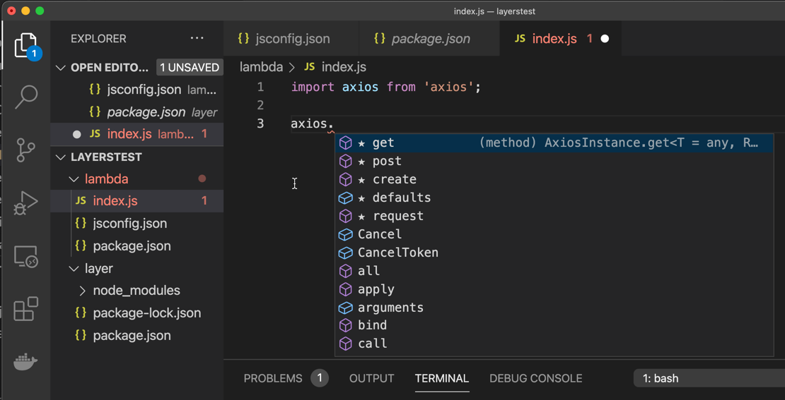

# Overview

Simple demonstration of using a [jsconfig.json](lambda/jsconfig.json) file in a lambda project that uses zip layers for `node_modules`.

This allows naked imports in the [lambda/index.js](lambda/index.js) to find the modules that are only installed in the [layer/package.json](layer/package.json) project.

# Example

For example, in `index.js`, without the `jsconfig.json` file the following import will have no type information, but with the `jsconfig.json` file it will have type information:

```
import axios from 'axios';
```

## Screenshot


